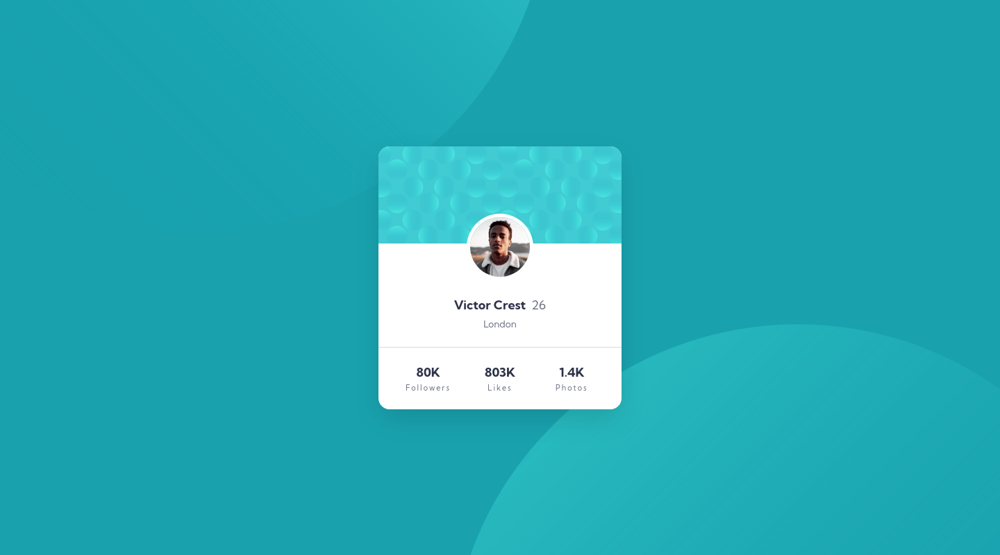
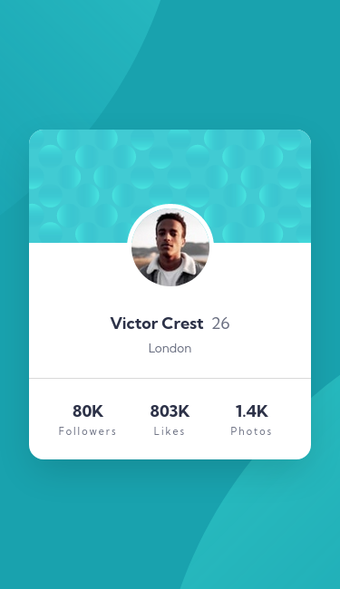

# Profile card component solution

This is a solution to the [Profile card component challenge on Frontend Mentor](https://www.frontendmentor.io/challenges/profile-card-component-cfArpWshJ). Frontend Mentor challenges help you improve your coding skills by building realistic projects. 

## Table of contents

- [Profile card component solution](#profile-card-component-solution)
  - [Table of contents](#table-of-contents)
  - [Overview](#overview)
    - [The challenge](#the-challenge)
    - [Screenshot](#screenshot)
      - [Desktop (1440px)](#desktop-1440px)
      - [Mobile (375px)](#mobile-375px)
      - [Original design](#original-design)
    - [Links](#links)
  - [My process](#my-process)
    - [Built with](#built-with)
    - [What I learned](#what-i-learned)
  - [Author](#author)

## Overview

### The challenge

- Build out the project to the designs provided

### Screenshot

Here is the component at various sizes.
#### Desktop (1440px)

#### Mobile (375px)

#### Original design

### Links

- Solution URL: [Solution](https://your-solution-url.com)
- Live Site URL: [Github page](https://padrontoni.github.io/FM-Profile-card/)

## My process

### Built with

- Semantic HTML5 markup
- CSS custom properties
- Flexbox
- CSS Grid
- Mobile-first workflow
- BEM methodology
- ITCSS architecture

### What I learned

I've learned to better handle background image positions and new ways of using custom properties with calc 

## Author

- Website - [Simone Boccuzzi](https://github.com/PadronToni)
- Frontend Mentor - [@PadronToni](https://www.frontendmentor.io/profile/yourusername)
